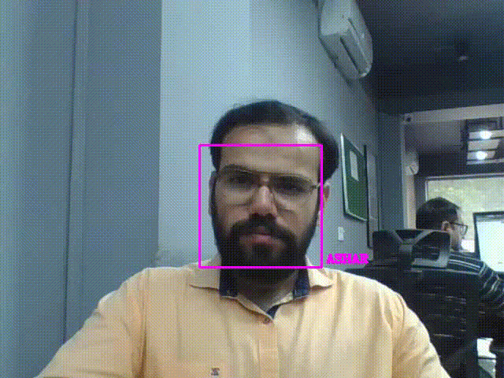

# Real-Time Face Recognition on Your Own Dataset


Real-time face recognition using a webcam or static images with the help of the `face_recognition` library.

This project allows you to train on your own images and perform live face recognition using a webcam or verify identities from test images.


## Demo



## Setup Instructions

1. Create and activate a new conda environment:
```
$ conda create --name face_rec python=3.7 -y
```

```
$ conda activate face_rec
```

2. Install the required dependencies:

```
$ pip install -r requirements.txt
```
## Usage

 ### Step 1: Prepare your data
- Add training images to the images/ folder.
- Add test images to the test_image/ folder if you're not using a webcam.

### Step 2: Run the recognition scripts
▶️ For real-time webcam recognition:
```
$ python real_time_recognition.py
```
🖼️ For comparing test images:
```
$ python compare_image.py
```
This will compare faces from test_image/ with the known encodings from training_image/.


## 📌 Note

Ensure your webcam is connected and accessible if you're using the real-time mode.

The face_recognition library uses dlib, which may require additional system dependencies like CMake, Boost, and a working C++ compiler, especially on Windows.

## 🔗 Links

[](https://www.linkedin.com/in/abdul-raheem-ashar-6aa40a1bb/)


## Authors

[@ashar-ashfaq](https://github.com/ashar-ashfaq)

